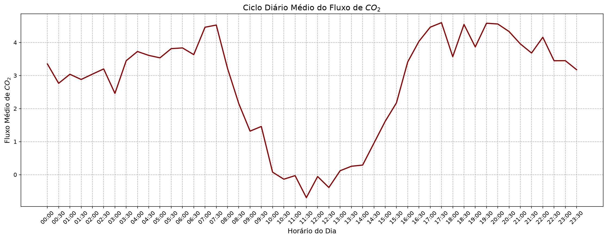

# Análise de Dados — Estação de Monitoramento LI-COR Eddy Covariance (Nebraska, 2013)

Notebook de análise exploratória de dados micrometeorológicos coletados por uma estação de monitoramento **Eddy Covariance da LI-COR**, localizada em Nebraska, no ano de 2013. O objetivo é mostrar que é possível conduzir esse tipo de análise usando apenas **Python e Pandas**, sem depender do ecossistema proprietário da LI-COR.

## Sobre o dataset

O dataset é o output público de processamento do **EddyPro** (software da LI-COR), disponibilizado no site oficial da LI-COR. Principais características:

- **17.520 linhas** × **198 colunas**
- Cada linha corresponde a um intervalo de **30 minutos** de medição, cobrindo um ano completo (365 dias)
- Formato CSV, com a primeira linha de metadados sendo ignorada na leitura (`skiprows=1`)

> O arquivo `eddypro.csv` **não está incluído neste repositório** — deve ser baixado do site da LI-COR e colocado na mesma pasta do notebook antes da execução.

## Perguntas que o notebook busca responder

1. Como o fluxo de CO₂ se comporta em função do tempo, e quais as características de sua periodicidade ao longo do ciclo diário de 24 horas?
2. Qual a taxa de variação do fluxo de calor latente em resposta ao aumento da radiação solar entre 05:00 e 09:00 da manhã?
3. Qual a diferença na capacidade média de retenção de carbono do ecossistema em dias de temperatura extrema (acima do percentil 90) comparado a dias de temperatura amena?

> No estado atual, o notebook desenvolve por completo a **pergunta 1** (ciclo diário médio do fluxo de CO₂). As perguntas 2 e 3 estão propostas, mas ainda não implementadas.

## O que o notebook faz

- Carrega o CSV com `pandas` e inspeciona shape, tipos de dados e memória (`df.info()`)
- Explora as 198 colunas disponíveis
- Filtra as colunas relevantes para a pergunta 1 (`date`, `time`, `co2_flux`, `qc_co2_flux`)
- Converte colunas de `str` para `float` e trata valores ausentes (código de erro `-9999.0`) e medições de baixa qualidade (`qc_co2_flux == 2`) como `NaN`
- Agrupa os dados por horário do dia e calcula o fluxo médio de CO₂
- Plota o **ciclo diário médio do fluxo de CO₂** com `matplotlib`

## Requisitos

- Python 3.12+
- Jupyter Notebook / JupyterLab
- pandas
- numpy
- matplotlib

## Próximos passos

- Responder à pergunta 2 (taxa de variação do calor latente vs. radiação solar)
- Responder à pergunta 3 (retenção de carbono em dias extremos vs. amenos)
- Adicionar tratamento de outliers mais robusto para as demais variáveis